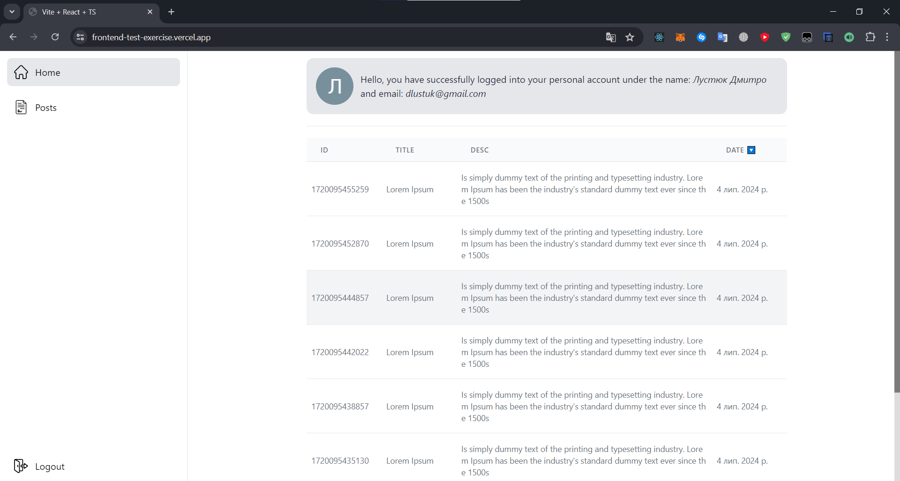
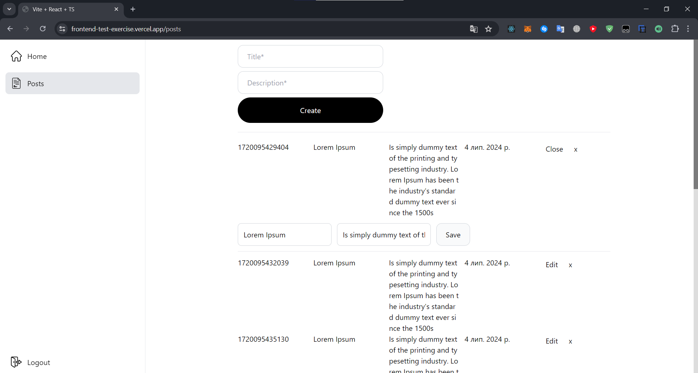

<h1>React.js Test-Exercise</h1>




## Technology Stack

<ul>
  <li>▶️ React.js(Vite)</li>
  <li>🔑 Auth0</li>
  <li>✨ Tailwind</li>
  <li>✅ Vitest</li>
  <li>🔍 Tanstack-Router</li>
  <li>🧱 Tanstack-Table</li>
</ul>

## Requirements

1. Breakdown of the structure into appropriate levels-layers:
 • Application logic should be separated into separate layers, subdomains, modules, domains, services, hooks, components, routes, and dependencies

2. Use of technologies defined by the task:
 • RxJS
 • DI (Dependency Injection)
 • TypeScript
 • Tailwind CSS
 • Tailwind Material
 • Auth0
 • Tanstack-Routing
 • Tanstack-Table
 • React

3. Selection of UI-kit components:
 • Create a set of user interface components (UI-kit) based on Tailwind CSS and Tailwind Material.
 • Components should be reusable and modular.

4. Connecting additional tools:
 • Linter: Using ESLint to check code style and possible errors.
 • Tests: Implementing testing (eg using Jest or React Testing Library) to ensure code quality.

## Getting Started

```js
    git clone https://github.com/WadoxFX/Frontend-Test-Exercise.git
    npm i
    npm run dev
```